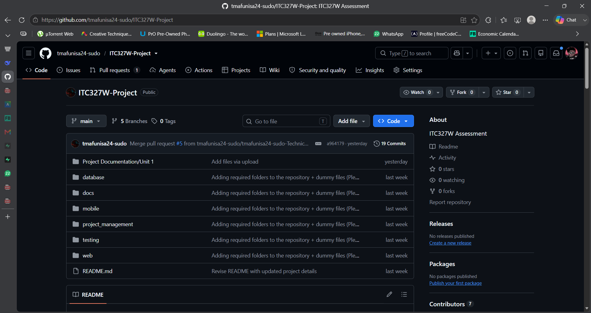
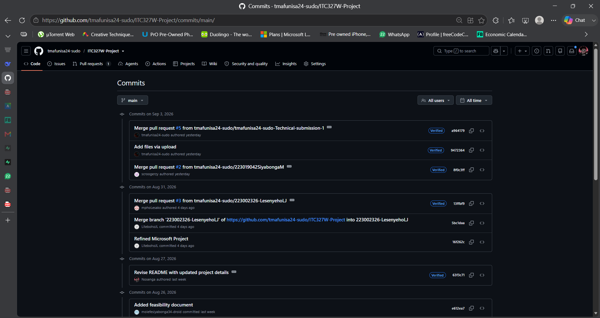
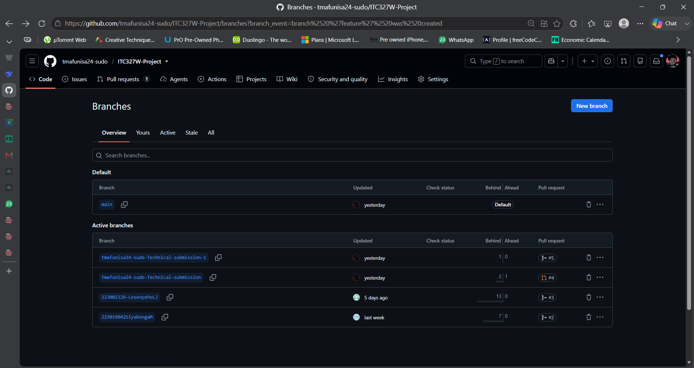

# GitHub Evidence – Click Computer and Accessories

## Repository Overview

**Repository URL:** https://github.com/tmafunisa24-sudo/ITC327W-Project

**Repository Name:** ITC327W-Project

**Status:** Active and maintained by all 10 team members

---

## Repository Structure

ITC327W-Project/
├── README.md
├── docs/
│ ├── stakeholder/
│ ├── requirements/
│ ├── feasibility/
│ ├── risks/
│ ├── meetings/
│ └── architecture/
├── project-management/
├── web/
├── mobile/
├── database/
└── testing/

---

## Branch Structure

| Branch | Purpose | Last Updated |
|--------|---------|--------------|
| `main` | Final stable version | 04 September 2026 |
| `feature/docs` | Documentation updates | 03 September 2026 |
| `feature/flutter` | Flutter development | In Progress |
| `feature/aspnet` | ASP.NET API development | In Progress |
| `feature/supabase` | Supabase setup | In Progress |
| `feature/testing` | Testing documentation | In Progress |

---

## Team Contributions

| Member | Commits | Key Contributions |
|--------|---------|-------------------|
| Lesako M (M1) | 8 | Project coordination, SRS integration |
| Tladi K (M2) | 7 | Stakeholder analysis, evidence |
| Nosenga B (M3) | 12 | GitHub setup, README, presentation |
| Mafunisa T (M4) | 10 | Architecture, technical documentation |
| Hlalele D (M5) | 6 | Requirements, SRS |
| Ndlovu N (M6) | 5 | Risk register |
| Taibosch K (M7) | 5 | Problem analysis, feasibility |
| Molefe B (M8) | 6 | Feasibility study |
| Lesenyeho LJ (M9) | 8 | Progress tracker, MS Project |
| Winkel K (M10) | 6 | Documentation, formatting |

---

## Evidence Screenshots

### Screenshot 1: Repository Overview

*Figure 1: GitHub repository with README and folder structure.*

### Screenshot 2: Commit History

*Figure 2: Regular commit activity showing team participation.*

### Screenshot 3: Branch Structure

*Figure 3: Branch structure showing feature branches for each component.*

### Screenshot 4: Project Board

*Figure 4: Project board tracking tasks and progress.*

---

## Verification

| Item | Status | Verified By | Date |
|------|--------|-------------|------|
| Repository accessible | ✅ Yes | Lesako M | 30 Aug 2026 |
| README complete | ✅ Yes | Lesako M | 30 Aug 2026 |
| All members have commits | ✅ Yes | Lesako M | 30 Aug 2026 |
| Branch structure in place | ✅ Yes | Lesako M | 30 Aug 2026 |

